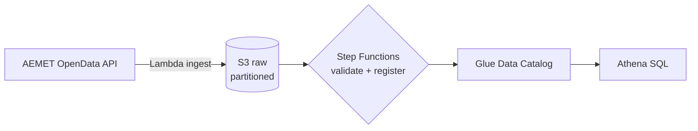

# AWS Serverless ETL

Serverless batch pipeline on the AWS free tier: Spanish weather observations (AEMET
OpenData) ingested by Lambda, orchestrated with Step Functions, cataloged in Glue and
queried with Athena — all provisioned with Terraform and gated by CI.


> **Status: scaffold / in active development.** Structure, IaC skeleton and CI are in
> place; pipeline implementation follows the roadmap below.

## What this demonstrates

A deliberately small, well-engineered AWS counterpart to my Azure work
([spain-energy-lakehouse](https://github.com/gonzalonao/spain-energy-lakehouse)):

- **Ingestion** — Lambda pulling AEMET OpenData (free API key) into S3, partitioned
  `raw/station=/date=`, idempotent re-runs.
- **Orchestration** — Step Functions state machine: ingest → validate → partition
  registration, with retries and catch states.
- **Catalog & query** — Glue Data Catalog table over S3, queried with Athena
  (partition-pruned SQL kept in `sql/athena/`).
- **Engineering practice** — Terraform IaC, GitHub Actions CI (lint, types, tests,
  `terraform validate`), no console-clicked resources.

## Architecture



## Repository layout

```
infra/terraform/     S3, Lambda, Step Functions, Glue, IAM — all IaC
src/lambdas/         Lambda handlers (typed, tested)
sql/athena/          table DDL and analysis queries
tests/               pytest suite
```

## Getting started

```powershell
git clone https://github.com/gonzalonao/aws-serverless-etl.git
cd aws-serverless-etl
uv sync
uv run pytest
```

Deployment requires an AWS account (free tier) and an AEMET API key:

```powershell
cd infra\terraform
terraform init
terraform plan
```

## Roadmap

- [x] Scaffold: structure, Terraform/CI skeletons
- [ ] Lambda ingest: AEMET observations → S3 raw, idempotent partitions
- [ ] Step Functions: orchestration with retries + failure notifications
- [ ] Glue catalog + Athena DDL and example analyses
- [ ] Cost notes: staying inside the free tier, budget alarm

## Author

**Gonzalo López Crespo** — [LinkedIn](https://linkedin.com/in/gonzalolopezcrespo) · [GitHub](https://github.com/gonzalonao)
